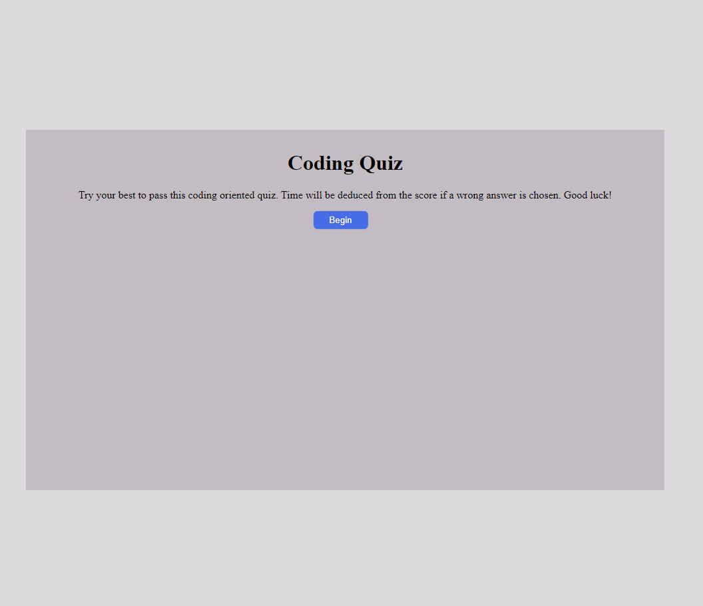
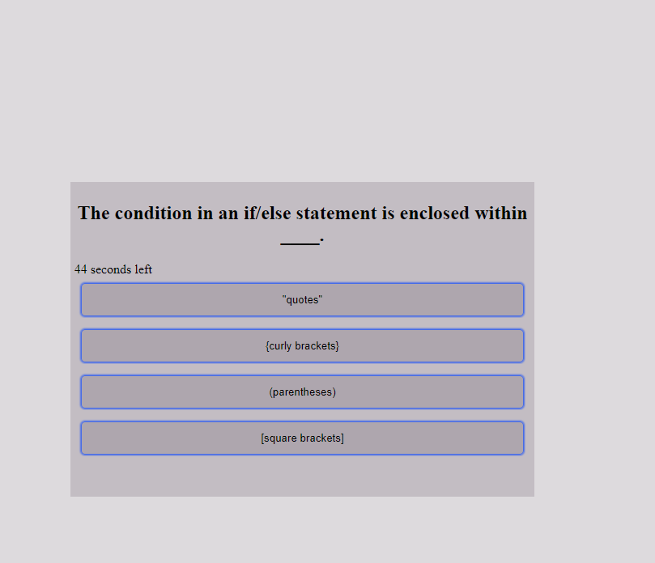
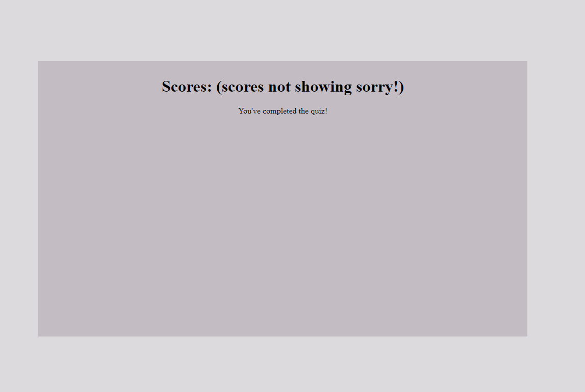

# Coding assessment

This is a timed coding assessment that tests the user's knowledge on various topics related to coding in terms of history and syntax. The timer acts as a final score for the user and can be saved to get a higher score at the end of the assessment.

## Screenshots

## Links
* [Repo](https://github.com/Undrcver/Coding-Quiz)
* [Webpage](https://undrcver.github.io/Password-Generator/)

## Languages Used
-CSS -JavaScript -HTML

## Luis Alicea 
